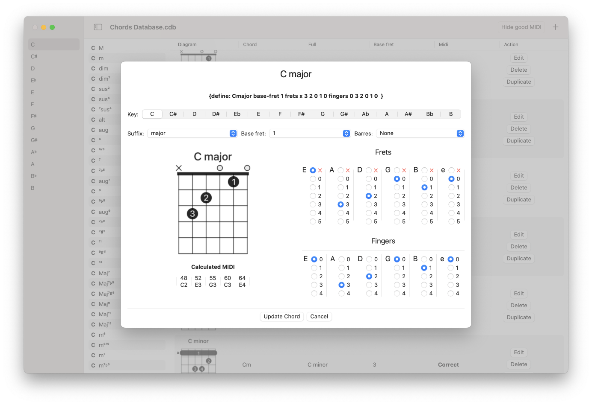

#  Chords Database

For my [Chord Provider](https://github.com/Desbeers/Chord-Provider) application, I use the great [Swifty Guitar Chords](https://github.com/BeauNouvelle/SwiftyGuitarChords) package.
It has a database with all the known chords.

This macOS Ventura application shows all those chords.

## The database is not perfect and I wrote this application to view and alter them

- A new file will start with the default database.
- You can save your altered database in the *SwiftyGuitarChords* format.
- And you can open it again.

## Known issues with the database

- MIDI values are sometimes wrong; this application will re-calculate them.
- Some chords are missing or not correct. It is not easy to add them to a JSON file. This application has a form for that.
- There is an optional `Capo bool` that has no fuction.
- All chord will get a UUID() ID; they are not *really* indentifiable. I like to use the 'ChordPro' `{define}' for that; however, that does noet have a 'Barres'. Thinking about it...

## Known issues with SwiftyGuitarChords

- I'm missing "D#", "G#" and "A#" as keys (I will send a Pull Request for that).
- The base implementation of ChordPostion only implements a decoder.

This application is ment to alter the database in an easy way and written to help [Swifty Guitar Chords](https://github.com/BeauNouvelle/SwiftyGuitarChords) for the most accurate database as possible in an easy way.

 See [This issue on SwiftyGuitarChords](https://github.com/BeauNouvelle/SwiftyGuitarChords/issues/7)
 
It is all in a struct; it can be exported in any way you like...

BTW: I love SwiftUI to write *quick and dirty* applications!
