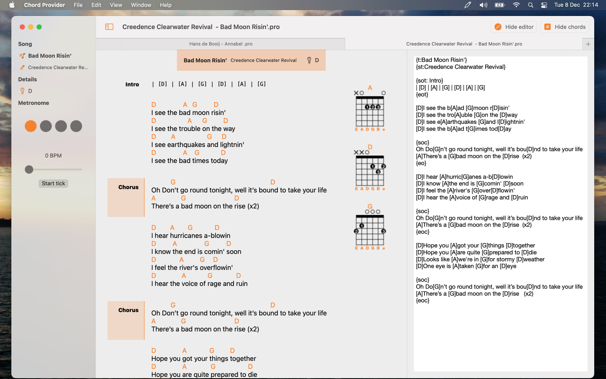

# Chord Provider

## A Cordpro file parser and editor in SwiftUI 2.0

There are many "chordpo" parsers in this world, however, none are *really* native in the Apple world. I mean, the macOS world, it is afterthought... Not for me.

This is for macOS and iOS. Written in SwiftUI 2.0, so Big Sur or iOS 14.

- System colors
- System fonts
- Dark screen support

### iCloud

It makes an iCloud folder; that's where your songs are stored.

### Thanks

Stole code (and ideas) from:

[songpro-swift](https://github.com/SongProOrg/songpro-swift)

[ChordsJS](https://github.com/AlexSchwabauer/ChordJS)
