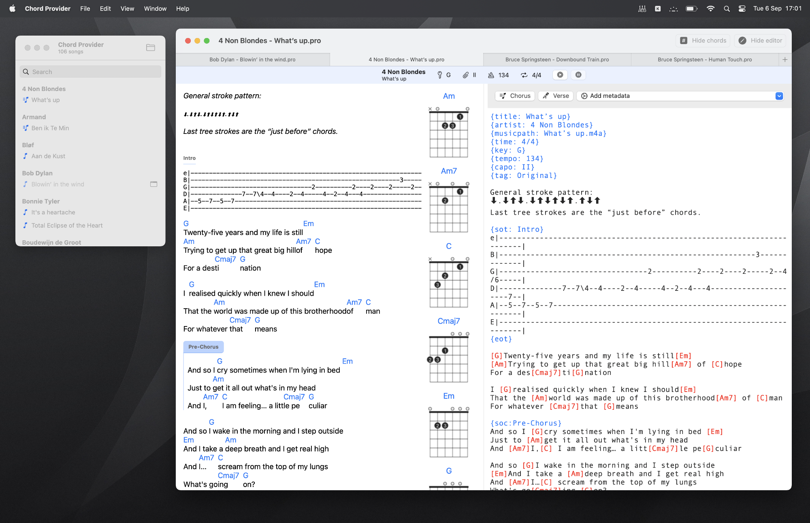

# Chord Provider

## A Cordpro file parser and editor in SwiftUI 4

There are many "chordpo" parsers in this world, however, none are *really* native in the Apple world.

I mean, in the macOS world, it is often an afterthought... Not for me.

This is for macOS and iOS. Written in SwiftUI 4, so macOS Ventura or iOS 16 only.

The branch 'SwiftUI-3' has an older version for macOS Monterey or iOS 15, however, I don't update that version anymore.

### iCloud

The iOS app makes an iCloud folder named "Chord Provider"; that's where your songs should be stored. In the macOS app, you can select a folder with your songs. If you use the same iCloud folder; updates are instantly.

### Known issues

- It only handles files with the '.pro' extension.
- When you switch from light to dark mode and visa-versa; the colors and chord diagrams are not correct.
- 'DocumentGroup', used to show the songs, is very buggy and limited.

### Thanks

Stole code (and ideas) from:

[songpro-swift](https://github.com/SongProOrg/songpro-swift)

The chord diagrams are made with [Swifty Guitar Chords](https://github.com/BeauNouvelle/SwiftyGuitarChords)
