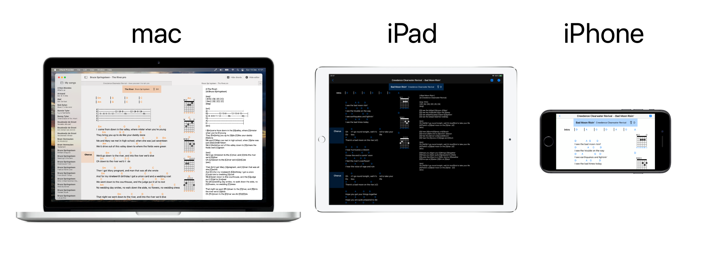

# Chord Provider

## A Cordpro file parser and editor in SwiftUI 2.0

There are many "chordpo" parsers in this world, however, none are *really* native in the Apple world. I mean, the macOS world, it is afterthought... Not for me.

This is for macOS and iOS. Written in SwiftUI 2.0, so Big Sur or iOS 14 only.

- System colors
- System fonts
- Dark screen support

### iCloud

The iOS app makes an iCloud folder named "Chord Provider"; that's where your songs should be stored. In the macOS app, you can select a folder with your songs. If you use the same iCloud folder; updates are instantly.

### Known issues

#### macOS

- If you change color-scheme; the chord diagrams are not updated. They will be correct again after a restart of the app.

##### The sidebar

This is still work in progress...

- It only lists files with the '.pro' extension.
- It doesn't remember its scrolled position when you open a song in a new window or tab; the selected song will be more or less on the top. I don't know (yet?) how to keep its scroll-position fixed; it's not easy in a SwiftUI DocumentGroup...

#### iOS

- Hand-off is not working. It tries to 'hand-off' to macOS, however, if you click on the icon, a new song is opened.

### Thanks

Stole code (and ideas) from:

[songpro-swift](https://github.com/SongProOrg/songpro-swift)

[ChordsJS](https://github.com/AlexSchwabauer/ChordJS)

The database with the chords came from [Swifty Guitar Chords](https://github.com/BeauNouvelle/SwiftyGuitarChords)
